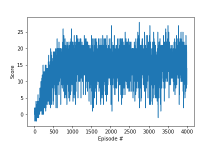

# Report
-------------

In the following we provide a detailed write up of the solution of the Banana Navigation environment.
We have implemented a dqn-agent, i.e. deep Q-network agent, similar to the one outlined and implemented (for the Atari 2600 games) in [Mnih1, Kavukcuoglu, Silver, et. al.](http://www.nature.com/articles/nature14236).  
Although there were previous attempts to approximate  the action-value function Q of the MDP via deep neural networks, those were less successful than the one in [Mnih, Kavukcuoglu, Silver, et. al.](http://www.nature.com/articles/nature14236).  The authors of the mentioned paper added the following two key features to cure the shortcomings of previous tries:
* memory replay: redomization over the data to remove correlations in the observation sequences;
* target Q-network: the action-values are only updated periodically to reduce correlations with the target;

Note that we will not exactly follow this approach but rather use soft updates of the target Q-network to overcome problems of correlations with the target.
Next, we describe in detail how the learning is done and implemeted
in our dqn agent.

## The Learning Algorithm

The most convenient way to give the learning algorithm is in terms of pseudocode:

**Algorithm for deep Q-learning with experience replay and soft update.**:

Initialize action-value function $Q$ with random weights $\theta_i$

Initialize action-value function $\hat Q$ with random weights $\theta^-_i$

Initialize replay memory $D$ to capacity ReplayBufferSize

**For** episode=1, MaxEpisodes **do**
>  Initialize/reset environment and get first state $s_1$
>
> **For** t=1, T **do**
>> With probability $\epsilon$ select a random action $a_t$ otherwise select $a_t = argmax_a Q(s_t, a; \theta_i)$
>>
>> Execute action $a_t$ in emulator/environment and observe reward $r_t$ and state $s_{t+1}$
>>
>> Store transition $(s_t, a_t, r_t, s_{t+1})$ in $D$
>>
>> **if** t **mod** UpdateEvery = 0 **do**
>>> Sample minibatch (of batch size BatchSize) of transitions $(s_j, a_j, r_j, s_{j+1})$ from $D$
>>>
>>> Set $y_j = r_j$ if episode terminates at step $j+1$ otherwise $y_j = r_j + \gamma\, max_{a'} \hat Q(s_{j+1}, a'; \theta^-_i)$
>>>
>>> Perform a gradient descent step with loss function $(y_j - Q(s_j, a_j;\theta_i))^2$ with respect to the weights $\theta_i$
>>>
>>> Soft update the target network, i.e. $\theta^-_i = (1 - \tau)\,\theta^-_i + \tau \,\theta_i$
>>
>> **End If**
>>
> **End For**

**End For**

The following table summarizes the values for all the parameters which are used during training:

|ReplayBufferSize| BatchSize |Gamma | Learning Rate | Tau | MaxEpisodes | UpdateEvery |
|------------------|------------|------|---------------|-----|------|---|
| 100000           | 64         | 0.99 |      0.0005   |0.001|4000 | 4 |

The implementation of the above algorithm was done in a function called `dqn`. This function makes us of three classes: `Agent`, `ReplayBuffer`, and `QNetwork`.
* The `ReplayBuffer` class has the functions: `add` and `sample`;
* `QNetwork`: this class defines the DNN which approximates the action-value function and is described in more detail below;
* The `Agent` class has the functions: `step`, `act`, `learn`, and `soft_update` where `act` gives $a_t$ and `step` calls, as in the order of the pseudocode,  `add`, `sample`, `learn`, and `soft_update`.

To see the performance increase of our agent we track the score for all episodes he is playing. This scores are the return values of the `dqn` function. Furthermore, `dqn` decreases the value of $\epsilon$ over the number of episodes:
$$ \epsilon = max(\epsilon_{end}, (\epsilon_{decay})^{episode}\, \epsilon_{start})$$

| $\epsilon_{start}$ | $\epsilon_{end}$ | $\epsilon_{decay}$ |
|------------------|----------------|------------------|
|  1.              |    0.01        |    0.995         |

### Learning Curve

In this graphic we see the learning performace of our algorithm. First of all we note that the mean score (over 100 consecutiveepisodes) is reached around 530 episodes. Furthermore, we see that there appears to be a saturation in the learning curve after about 1360 episodes where the agent reaches its maximum performance of mean scores which lies around 17.

## The Architecture of the Deep Q-Network

The neural network which learns to approximate the action-value function consists of three linear fully connected layers. Between every two layers we use rectifier as non-linear activation functions. In more detail, the network looks as follows:

* The first fully connected layer has 37 input-channels, for the 37 dimensional state vector, and 64 output channels.

* First ReLU layer.

* The hidden fully connected layer with 64 input and output channels, respectively.

* Second ReLU layer.

* Output layer with 64 input and 4 output channels, i.e. for each action we get the Q value as an output.

## Ideas for Future Work

* Improve the learning performance of the non-visual agent by implementing a [prioritized experience replay](https://arxiv.org/abs/1511.05952) (and a [double DQN](https://arxiv.org/abs/1509.06461), or a [dueling DQN](https://arxiv.org/abs/1511.06581)). Use this improvements to re-attack the problem with the agent whose state space is given in terms of raw pixels. So far the best average score (over 100 episodes) was a bit more than two. Hence, this is nowhere near the performance of the agent who gets the "pre-processed" states space where the benchmark for the above described model lies around 17, without doing any of the suggested imporvements.

* For the Visual Banana Navigation I have to implement a stacking of three to four frames to make up a state of the environment because otherwise I will not be able to capture information about the velocity of the agent which seems to be a key feature by playing some episodes of the game myself.

**Note**: The unsuccessful attempts I tried so far can be found in the files ending in `_visual` and `_Pixels`.

